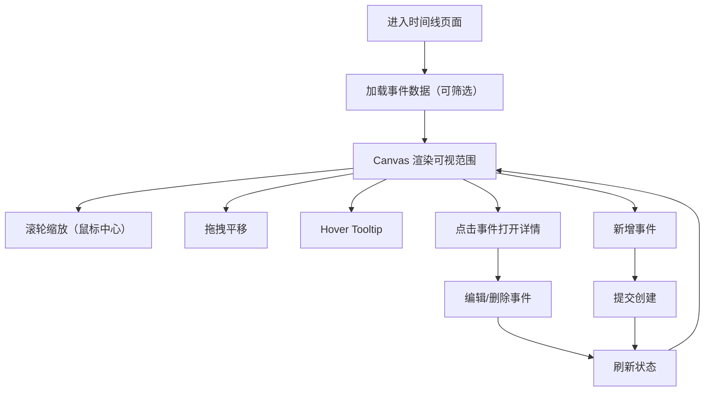

## 1. 产品概述
可编辑交互时间线网站（故事/人物/事件），前后端分离。前端使用 Canvas 高性能渲染时间轴，支持缩放与拖拽；后端提供事件增删改查与筛选，并支持 PostgreSQL 与 SQLite 两种数据库（默认本地 SQLite）。
- 目标用户：年表维护者、研究者、粉丝站内容编辑者
- 产品价值：用可视化方式维护大量事件数据，定位关键节点并持续迭代更新

## 2. 核心功能

### 2.1 用户角色（MVP）
| 角色 | 注册方式 | 核心权限 |
|------|----------|----------|
| 编辑者 | 无需登录（MVP） | 查询、筛选、增删改查事件 |

### 2.2 功能模块
1. **时间线页面**：Canvas 渲染层、动态刻度、事件点、tooltip、详情抽屉
2. **控制与筛选**：缩放、模式切换（叠加/并列）、人物/类型/时间范围筛选、搜索
3. **编辑面板**：新增、编辑、删除事件（表单抽屉）

### 2.3 页面详情
| 页面名称 | 模块名称 | 功能说明 |
|----------|----------|----------|
| 时间线页面 | Canvas 时间轴 | 绘制时间轴线、事件点；只渲染可视范围事件；1000+ 事件不卡顿 |
| 时间线页面 | 交互层 | 鼠标滚轮缩放（以鼠标为中心）、拖拽平移、hover tooltip、点击详情 |
| 时间线页面 | 详情/编辑抽屉 | 展示/编辑/删除事件；新增事件入口 |

## 3. 核心流程

## 4. 用户界面设计
### 4.1 设计风格
- 深色现代简洁
- 顶部控制条 + 主画布区域 + 右侧抽屉（详情/编辑）
- 动效：抽屉开合与交互反馈轻量化（VueUse Motion）

### 4.2 响应式
- 桌面优先；移动端可后续增强为双指缩放与拖拽

