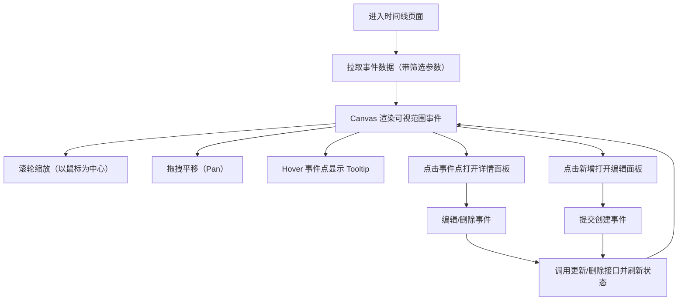

## 1. 产品概述
面向“故事/人物/事件”的可编辑交互时间线网站，使用高性能 Canvas 渲染时间轴与事件点，支持缩放与拖拽，并提供完整的事件增删改查与筛选能力。
- 目标用户：内容编辑者、研究者、粉丝站/作品年表维护者
- 产品价值：用可视化方式组织大量事件数据，快速定位关键节点并持续维护

## 2. 核心功能

### 2.1 用户角色（可选）
| 角色 | 注册方式 | 核心权限 |
|------|----------|----------|
| 编辑者 | 无需登录（MVP） | 查询、筛选、增删改查事件 |

### 2.2 功能模块
1. **时间线浏览页（主页面）**：Canvas 时间轴、刻度、事件点、tooltip、详情面板
2. **数据管理（同页侧边栏/弹窗）**：新增/编辑/删除事件、批量示例数据加载

### 2.3 页面详情
| 页面名称 | 模块名称 | 功能说明 |
|----------|----------|----------|
| 时间线浏览页 | 控制面板 | 缩放按钮、模式切换（叠加/并列）、人物/类型筛选、时间范围筛选、搜索 |
| 时间线浏览页 | 时间轴渲染层（Canvas） | 高性能绘制时间轴线、刻度标记、事件点；仅渲染可视范围内事件 |
| 时间线浏览页 | 交互层 | 鼠标滚轮缩放（以鼠标点为中心）、拖拽平移、hover tooltip、点击展开详情 |
| 时间线浏览页 | 事件详情面板 | 展示标题/日期/描述/图片/人物/类型；提供编辑、删除入口 |
| 时间线浏览页 | 编辑面板（抽屉/弹窗） | 表单字段：标题、日期、描述、图片 URL、人物、类型；提交后实时更新 |

## 3. 核心流程
主要流程：浏览 → 缩放/拖拽定位 → hover 预览 → 点击查看详情 → 编辑/新增/删除 → 通过筛选与搜索复用视图

## 4. 用户界面设计

### 4.1 设计风格
- 主题：深色现代简洁（可切换浅色作为后续增强）
- 主色：蓝青色高亮（用于选中事件、刻度强调）
- 字体：标题使用更具展示感的无衬线字体，正文使用易读字体；强调清晰层级
- 布局：顶部控制条 + 主画布区域 + 右侧详情/编辑抽屉
- 动效：缩放与面板开合使用轻量动效（Motion One / VueUse Motion）

### 4.2 页面设计概览
| 页面名称 | 模块名称 | UI 元素 |
|----------|----------|----------|
| 时间线浏览页 | 控制面板 | 分段按钮（模式切换）、筛选下拉、多选标签、日期范围输入、搜索框、缩放按钮 |
| 时间线浏览页 | 画布区域 | 主时间轴线、动态刻度（年/月/日）、事件点（不同颜色区分类型/人物）、悬浮高亮 |
| 时间线浏览页 | Tooltip/详情/编辑 | 悬浮卡片、详情抽屉、表单抽屉（统一样式与动效） |

### 4.3 响应式
- 桌面优先：大画布交互最佳
- 移动端增强（后续）：双指缩放、单指拖拽、点击替代 hover

