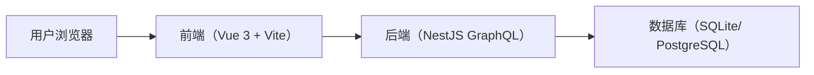
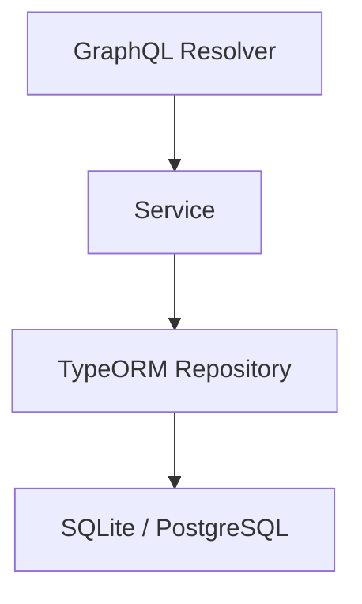
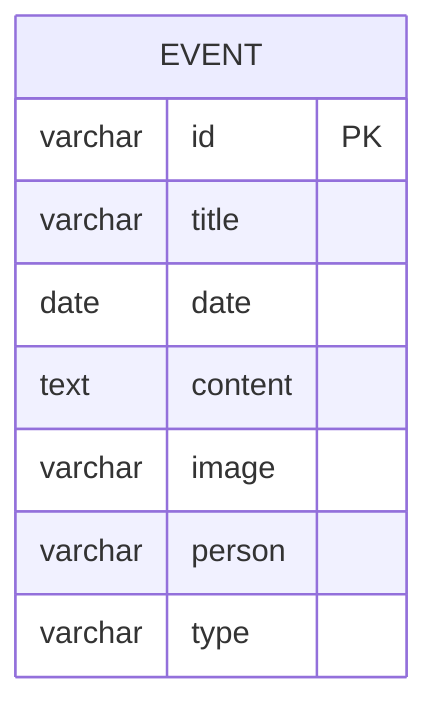

## 1. 架构设计


## 2. 技术说明
- 前端：Vue 3 + TypeScript + Vite
- 状态管理：Pinia
- 样式：TailwindCSS
- 动画：VueUse Motion
- 渲染：Canvas 2D（rAF 优化 + 可视区渲染裁剪）
- 后端：NestJS + GraphQL（code-first）
- ORM：TypeORM
- 数据库：SQLite（默认本地文件）/ PostgreSQL（可选 Docker）

## 3. 路由定义（前端）
| 路由 | 目的 |
|------|------|
| / | 时间线主页面 |

## 4. API 定义（GraphQL）
### 4.1 数据结构
```ts
type Event = {
  id: string
  title: string
  date: string
  content: string
  image?: string | null
  person: string
  type: string
}
```

### 4.2 查询
- Query: events(filter): [Event!]!
- filter：persons、types、dateFrom、dateTo、search

### 4.3 变更
- Mutation: createEvent(input): Event!
- Mutation: updateEvent(id, input): Event!
- Mutation: deleteEvent(id): boolean!

## 5. 服务端架构图


## 6. 数据模型
### 6.1 ER 图


