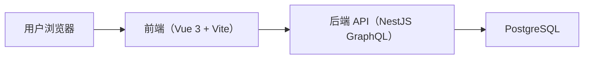
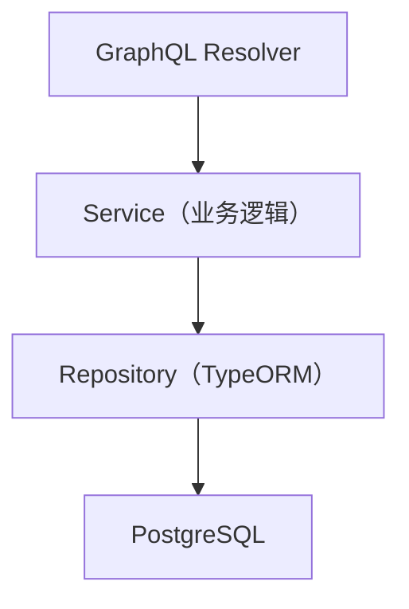
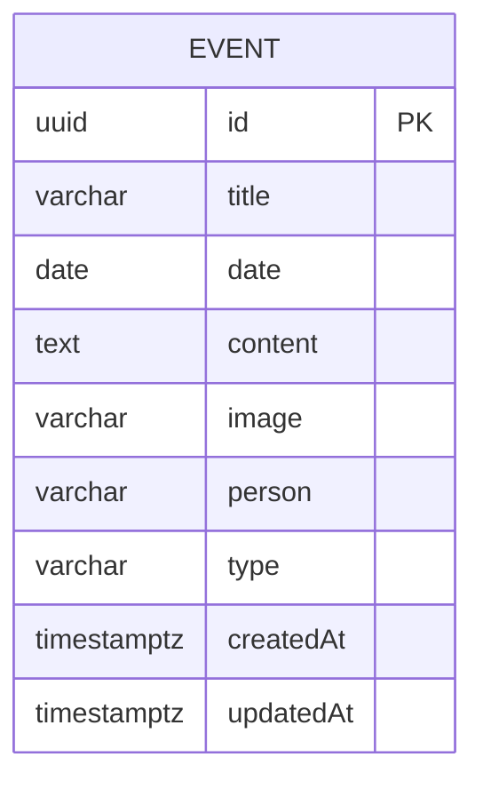

## 1. 架构设计



## 2. 技术说明
- 前端：Vue 3 + TypeScript + Vite
- 状态管理：Pinia
- 样式：TailwindCSS
- 动画：VueUse Motion（或 Motion One）
- 可视化渲染：Canvas 2D（requestAnimationFrame + 可视范围裁剪）
- 后端：Node.js + NestJS
- 接口：GraphQL（code-first）
- ORM：TypeORM
- 数据库：PostgreSQL

## 3. 路由定义（前端）
| 路由 | 目的 |
|------|------|
| / | 时间线主页面（浏览/筛选/编辑） |

## 4. API 定义（GraphQL）

### 4.1 数据类型
```ts
type Event = {
  id: string
  title: string
  date: string
  content: string
  image?: string | null
  person: string
  type: string
}
```

### 4.2 查询与筛选
- Query: events(filter): [Event!]!
- filter 支持：
  - persons: string[]
  - types: string[]
  - dateFrom: string
  - dateTo: string
  - search: string（匹配 title/content）

### 4.3 变更
- Mutation: createEvent(input): Event!
- Mutation: updateEvent(id, input): Event!
- Mutation: deleteEvent(id): boolean!

## 5. 服务端架构图


## 6. 数据模型

### 6.1 ER 图


### 6.2 DDL（索引与性能）
```sql
create table if not exists "event" (
  "id" uuid primary key default gen_random_uuid(),
  "title" varchar(200) not null,
  "date" date not null,
  "content" text not null,
  "image" varchar(1024),
  "person" varchar(120) not null,
  "type" varchar(120) not null,
  "createdAt" timestamptz not null default now(),
  "updatedAt" timestamptz not null default now()
);

create index if not exists idx_event_date on "event"("date");
create index if not exists idx_event_person on "event"("person");
create index if not exists idx_event_type on "event"("type");
create index if not exists idx_event_title_gin on "event" using gin (to_tsvector('simple', "title"));
create index if not exists idx_event_content_gin on "event" using gin (to_tsvector('simple', "content"));
```

